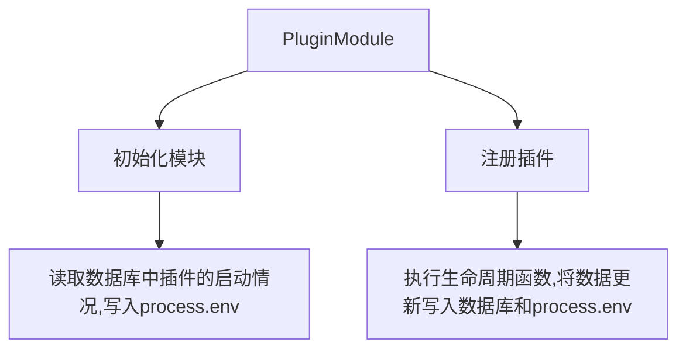
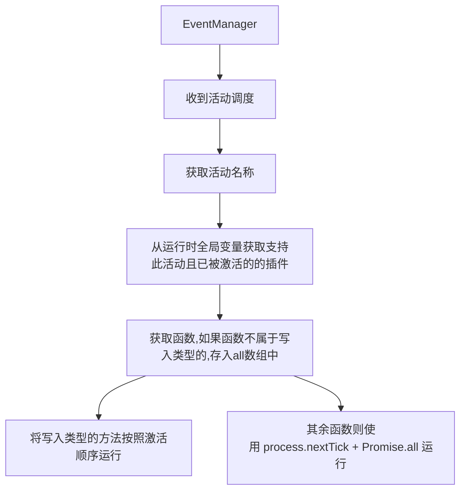

# 插件系统

| 创建日期     | 2022-08-23                                                                                                                            |
| ------------ | ------------------------------------------------------------------------------------------------------------------------------------- |
| 目标完成版本 | 2.x                                                                                                                                   |
| 参考问题:    | https://github.com/nx-space/core/issues/176, https://github.com/nx-space/core/issues/196, https://github.com/nx-space/core/issues/222 |
| 当前状态     | Pending                                                                                                                               |
| 所有者       | wibus <wibus@qq.com>                                                                                                                  |

# Summary 概要

在 NEXT 中实现一个类似于 Typecho, WordPress 等博客程序可热插拔的插件系统。

## 目标

一般

- 插件管理：可视化的插件管理界面，可以安装、卸载、更新、禁用、启用等操作。
- 插件仓库：可以查看所有插件的信息，可以搜索插件并安装。应当建立起适合的发布审核机制，保护插件的版本安全。
- 插件框架：提供开发脚手架，方便开发者快速开发插件，提供插件开发文档。

服务端插件扩展

- 后端 API 使用插件进行扩展，给予插件单独的路由
- 允许插件调度数据库进行数据处理与操作
- 允许插件通过已全局化的模块，允许插件注入其余的独立模块
- 允许插件对请求上下文进行操作，如设置请求头，设置响应头等
- 允许插件调用其他插件的方法

后台插件扩展

- 后台插件扩展，给予插件单独的路由，允许插件新增路由
- 允许插件对已存在的页面修改，实现在原有基础上的功能扩展

> ⚠️ 此提案的插件系统，并不属于模块插件化，模块插件化并未开始考虑

# Basic example

```js
import { Plugin } from "@nx-space/plugin-system";

export default class MyPlugin extends Plugin {
  // ...
}
```

# Motivation 动机

由于有很多功能我们核心团队都非常想实现，但是大多数都非常零散，如果将它们分别独立于一个模块里，未免有点浪费，因此使用一个个插件实现是一个非常正确的选择。

使用插件可以额外实现的功能包括且不限于

- 使用 **MWeb** 等编辑器推送文章
- 实现核心团队并不打算实现的功能
- 集成统计系统至前端、私有文章的特殊处理、可移植到各处的功能
- 使用微信或 QQ 等工具管理后台
- 文章可以在服务端实现短代码解析
- 发生操作活动时，可以请求 webhook url

在实现了插件系统后，有利于社区的生态建造，用户可以根据自己的需要开发插件拓展功能，使用者也可以更加方便地使用插件来满足自己的需求。

# Detailed design 详细设计

## 术语

- **Inject Point**
  - 可扩展功能的方法接口扩展注入点。
  - 注入点应该处于基本处理 --> 输出处理结果之间应用。
  - 注入点无法脱离基本处理方法单独执行，仅作为功能上的补充，对于扩展点的配置将会独立放入 Configs 表中的 plugin 字段。
  - 注入点中载入的处理方法间应看情况建立无/依赖/冲突关系。
  - 注入点载入的处理方法应当按照插件被激活时间倒序排列处理。
- **Plugin**
  - Inject Point（扩展注入点）的应用方法。
  - 对其中的处理方法应当更加精细区分，达到禁用/启动某一功能的程度
  - 激活依赖方法的控制权、插件依赖模块加载权交由用户
  - 插件应支持自己的独立模型进行配置

## 后端

### 启动时

启动时插件应当交由 PluginModule 负责加载，它的行为包括且理论不限于：

- 验证 Plugin 的配置定义文件是否存在且合法
- 验证 Plugin 内部使用的依赖是否安全且合法
- （非目标内）验证 Plugin 与其余 Plugin 是否存在冲突行为
- 将 Plugin 方法注册至 EventManager

EventManager 负责插件与 Core 自带方法的活动管理，它的行为包括且理论不限于：

- 在 core 的控制器中启动了 `@EventInject()` 的方法被执行时调度已启动且适用于此方法的插件
- 对 App 全局请求监听，对全部请求或返回中注入执行方法

EventManager 的实现可以参考 [minimajs](https://github.com/lorry2018/minimajs)

**配置定义**

**manifest.yml**

```yaml
name: Test
description: Description
version: 0.0.1
author: "?"
require: ">=1.5.3" # 最大支持的后端版本
dependencies:
  - Test-2: "1.0.0"
homepage: "?"
pluginSignKey: org.wibuswee.plugin.tests
```

- `name`：插件内部名称，详细规则请见 「Plugin Name 命名」
- `version`: 指定插件版本号
- `requires: >=1.5.3` 表示后端版本必须大于 1.5.3
- `pluginDependencies`: 如果依赖了其他插件则使用`pluginSignKey: version`的格式[可选]。
- `homepage`: 插件的主页[可选]。
- `pluginSignKey`: 识别插件的唯一密钥，防止出现同名插件问题
- `description`: 详细介绍[可选]。

**Plugin Name 命名**

遵循**大驼峰式命名法**进行命名，使用数字标识时需要使用下划线进行分隔，专有名词按照官方写法书写，若该插件开源，仓库命名可以加上 `nx-plugin-*` 标识，系统内部则使用其中的 `*`

- 仓库 `nx-plugin-ThisIsAPlugin`，内部 `ThisIsAPlugin`
- 仓库 `nx-plugin-Json_2_CSV`，内部 ``Json_2_CSV``

**plugin_sign_key 命名规则**

该参数主要用于校验插件的重复性，保证插件的唯一性

规则：全部采用小写标识，依照 `authorName.pluginName.nx` 标识进行书写
若 `authorname` 或者 `pluginname` 由多个单词构成，请采用小写忽略空格拼在一起，版本号采用**x.y.z 格式**

例：

> 插件名称：nx-plugin-AutoMailSend
>
> 作者名称：John Han
>
> 版本号：1.12.4

该插件的 plugin_sign_key 为 `automailsend.johnhan.nx`，内部名称为 `AutoMailSend` 其中名称可以依据作者喜好进行缩短，以上方插件继续举例：

缩减后的相关内容为：

> 插件名称：nx-plugin-Amail
>
> 作者名称：Han
>
> 版本号不变

该插件缩减之后的 plugin_sign_key 为 `amail.han.nx`，内部名称为 `Amail`

**版本号规范**

| Code status                               | Stage         | Rule                                         | Example version |
| ----------------------------------------- | ------------- | -------------------------------------------- | --------------- |
| First release                             | New product   | 从 1.0.0 开始                                | 1.0.0           |
| Backward compatible bug fixes             | Patch release | 增加第三位数字                               | 1.0.1           |
| Backward compatible new features          | Minor release | 增加中间数字并将最后一位重置为零             | 1.1.0           |
| Changes that break backward compatibility | Major release | 增加第一位数字并将中间和最后一位数字重置为零 | 2.0.0           |

**自定义模型**

考虑到易用性，全部自定义数据应当放在一个独立的 plugin 表中，参考 [mx-space/core](https://github.com/mx-space/core/tree/master/src/modules/serverless) 的微服务模型，模型必须要有: `key` 储存键名, `value` 储存键值

让插件通过数据库获取模型数据的方式大致有两种：

- [x] core 对需要使用数据的方法传入对应的模型操作方法，使用较为方便，仅需使用 jsdoc 标明即可
- [ ] 使用命令链接 mongodb，插件可以使用/操作更多的内容，但是安全性需要考虑

将定义模型的方法放置于插件类中，使用 jsdoc 标注 `@model` 在安装时将会 自动解析模型。使用 `@database` 将会在第一个参数传入 model

```typescript
class TestPlugin extends Plugin {
  /**
   * @model
   */
  public model() {
    return [
      { key: "webhooks", value: []},
      { key: "requestHooks", value: true},
    ]
  }
  
  /**
   * @database
   */
  public async requestWebHooks(model) {
    if (model.requestHooks) { 
      request.post(webhooks.[0], {body: "111"})
      return true
    }
  }
}
```


#### 主模块



**在插件中的插件生命周期**

插件的生命周期是从插件安装时开始，到插件卸载时结束。只需要 `start`, `stop`, `install`, `uninstall` 四个方法即可。

```typescript
class TestPlugin extends Plugin {
  constructor(options) {
    super(options);
  }
  override install(): void {}
  override start(): void {}
  override stop(): void {}
  override uninstall(): void {}
}
```

#### 活动经理



原本的流程的缺点很明显，方法全部需要排序运行的，若插件数量过多，或插件内部出现错误，将会导致响应错误/堵塞。若使用 `Promise.all` 的并发执行方式，却有可能会导致数据间的不一致，最终返回的数据可能不是最终的。

可以对插件进行分类，若调度方法并不是写入类型的，则将此方法放入 `Promise.all` 中执行。更者可以使用 `process.nextTick` 来执行。

**活动注入**

使用 `@EventInject()` 标记方法，编译时自动注入函数，装饰器应当接受一个参数，该参数是字符串，表示活动的名称，活动管理器会根据该名称调度活动。

```typescript
enum EventInjectMethod {
  GET_REQUEST = "request", // 接受请求时
  PUSH_RESPONSE = "response", // 发送响应时
  POST_CREATE = "create:post", // 在创建文章时调用
  POST_UPDATE = "update:post", // 在更新文章时调用
  POST_DELETE = "delete:post", // 在删除文章时调用
  POST_FIND = "find:post", // 在查询文章时调用
  PAGE_CREATE = "create:page", // 在创建页面时调用
  // ...
}
```

**插件定义处理方法**

PluginModule 自动识别插件类中所有的公开方法，并获取 jsDoc 中标注的注入点，并将其与插件方法绑定。EventManager 会根据注入点调度活动，传入的参数有差异。但接口定义是相同的

```typescript
interface ExecuteEvent {
  name: EventInjectMethod;
  args: any[];
}
```

- `name`: 活动名称
- `args`: 活动参数，参数格式参考 执行传入 args 类型 的说明。

```typescript
class TestPlugin extends Plugin {
  /**
   * @Inject create:posts
   * @Inject update:posts
   * @database
   */
  public async requestWebHooks(args, model) {
    if (model.request) reg(args.text);
  }
  private async reg(str) {}
}
```

**执行传入 args 类型**

- **Posts** 模块: Return `PostModel[] | PostModel`
- **Pages** 模块: Return `PageModel[] | PageModel`
- **Category** 模块: Return `CategoryModel[] | CategoryModel`
- **Links** 模块: Return `LinkModel[] | LinkModel`
- **Comments** 模块: Return `CommentModel[] | CommentModel`

**启动注入点**

注入装饰器应当处于控制器方法之上：

```ts
@Get("/")
@EventInject(EventInjectMethod[A_KEY]) // I'm here
async method(args) {
  return this.service.method(args);
}
```

#### 插件公开 API

**插件管理 API**

当插件被点击注册时，Core 将会为插件生成路径的 API。API 组成规则如下：

```
/plugins/{plugin_sign_key}/?action={action_name}
```

例如：`/plugins/org.wibuswee.plugin.test?action=install`。

**插件自定义 API**

插件并不局限于服务端处理中，但是对 API 的设计也应该慎重，避免暴露给客户端的 API 可能会导致客户端恶意调用。尽量遵守 RESTFul 规范。

以下是 API 自定义路由的几种设计，每种设计都有优缺点：

- [ ] `/plugins/{plugin_name}/{version}/{custom_router}/**`

  使用插件名字、版本号、与插件定义的路由作为路径，但是有可能会出现插件大小写问题, 如: `/api/plugins/test/1.0.2/test_router/`

- [ ] `/plugins/{plugin_sign_key}/{version}/{custom_router}/**`

  使用插件签名作为路径，可以排除大小写问题，但是路径过长

- [ ] `/plugins/{plugin_sign_key}/{custom_router}/**`

  使用插件签名作为路径，可以排除大小写问题，与上一个相比，这个接口减少了版本号的使用。如： `/api/plugins/org.nx-space.plugin.test/test_router/`

- [ ] `/{plugin_name}/{version}/{custom_router}/**`

  直接放置至 Root Router，有可能会与根路由冲突

- [ ] `/{plugin_sign_key}/{version}/{custom_router}/**`

  个人认为是一种较为理想的实现方式，但是与 NestJS 思想并不相符

- [ ] `/{custom_router}/**`

  可行，并不建议，不仅有可能与原路由冲突，甚至有可能与其他插件冲突

- [ ] `/plugins/{custom_router}/**`

  可行，并不建议，有可能与其他插件冲突

- [x] `/plugins/{plugin_name}/{custom_router}/**`

  需评定可行性和建议程度

- [x] `/plugins/{plugin_sign_key}/{custom_router}/**`

  需评定可行性和建议程度

当访问到此路由时，将会访问插件配置的对应方法，返回响应头同样需要配置。使用 `@Get()` 或 `@Post()` 注解，可以指定请求方法。

```typescript
class TestPlugin extends Plugin {
  @Get("/test")
  public async test(
    @Query() query: any,
    @Body() body: any,
    @Param() param: any,
    @Header() header: any,
    @Cookie() cookie: any,
    @Req() req: any,
    @Res() res: any
  ) {
    return {
      query,
      body,
      param,
      header,
      cookie,
      req,
      res,
    };
  }
}
```

> 此处的装饰器并非来自于 nestjs，而是 NEXT 额外提供的插件库。

**插件依赖库**

暂时不实现，考虑让开发者打包编译进入 js 文件

TBD.

**插件更新机制**

暂时不实现，考虑通过卸载替换安装方式

TBD.

**插件文件结构**

```
wibus-wee/Test
├── LICENSE
├── README.md
├── src
│   └── index.ts
├── dist
│   ├── index.js
│   └── manifest.yml
└── manifest.yml
```

- 如果在 `manifest.yml` 中没有指定 pluginSignKey，则会按照规则自动生成, 如 `wibus-wee.test.nx`，并储存在 `manifest.yml` 中。
- 如果出现同名插件，若 pluginSignKey 不相同，则同样会进行加载，但会提示用户出现昵称冲突。
- 若插件的信息全部相同，则会默认使用版本号更新的一者，将旧版本文件删除。

**如何开发插件**

TBD.

**如何调试插件**

TBD.

### 后台

考虑使用 React 作为后台的框架，需要保证插件的技术栈是 React. 可以借鉴 [react-plugin-system](https://github.com/yuancy-code/react-plugin-system) 的实现。

TBD.

# Drawbacks 缺点

- 实现成本较高，似乎尚没有前人在 NestJS 中实现类似的功能
- 对于 API 的设计较为复杂，需要控制器提供的方法提供扩展点

曾经想过将项目重构，不再使用 NestJS，但是 NestJS 提供了很多方便的功能，反而使用 Express 等底层平台，如何建立起一个标准的系统，是一个更大的难题

# Unresolved questions 未解决的问题

- [x] 自定义模型的配置存放位置（ ~~表内~~ / 单独表 ）
- [X] 应该如何合理地调度活动
- [x] 插件 API 的合理设计
- [x] 服务端如何实现插件扩展 / 如何实现可使用的扩展点
